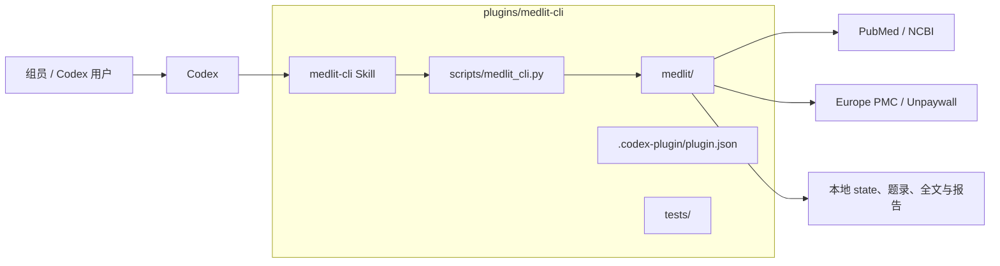
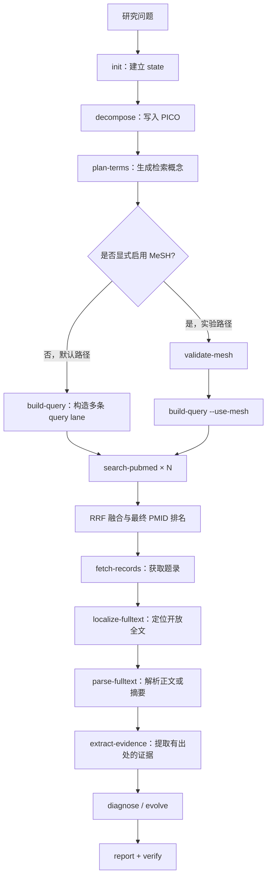
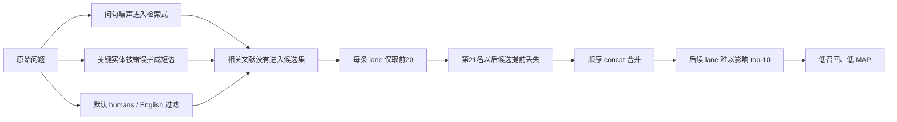
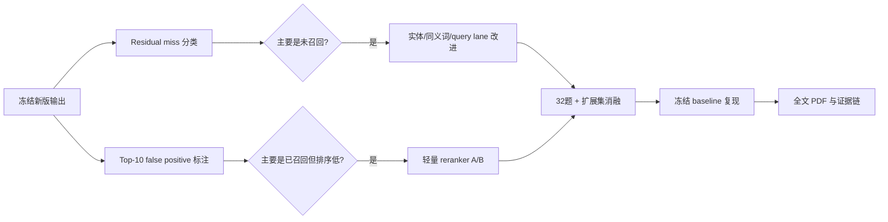

# MedLit CLI 插件架构与检索升级进展

> 更新时间：2026-08-23  
> 当前阶段：R2-Minimal 已完成，插件化、检索修复与可选 MeSH 状态机均通过验收

## 1. 当前系统架构

### 1.1 插件结构

MedLit 目前是一个可安装的 **Codex Plugin**。唯一维护的运行时代码位于 `plugins/medlit-cli/`，不依赖 MCP，也没有第二套独立检索实现。



| 目录 | 作用 |
|---|---|
| `.codex-plugin/plugin.json` | 插件名称、版本、能力和 Skill 入口 |
| `skills/medlit-cli/SKILL.md` | 告诉 Codex何时、按什么顺序调用 CLI |
| `scripts/medlit_cli.py` | 插件内统一命令入口 |
| `medlit/pubmed/` | 术语规划、MeSH 验证、查询构建和 PubMed 请求 |
| `medlit/retrieval/` | 多路结果融合，目前采用 RRF |
| `medlit/state/`、`evolution/` | 保存研究状态，判断下一步动作和终止条件 |
| `medlit/fulltext/`、`extraction/` | 开放全文定位、解析和证据抽取 |
| `tests/` | 查询、融合、PubMed provenance 和工作流状态测试 |

仓库根目录的启动脚本与评测程序均转向该插件运行时。因此，开发测试、BioASQ 评测和组员安装后的 Skill 使用同一套源码，避免“本地修好了，安装后仍运行旧逻辑”。

### 1.2 完整工作流



工作流以 JSON state 为主线。每一步都读取前一步结果并写回 state，因此可以中断后继续，也可以检查每条查询、每次返回和最终证据的来源。

### 1.3 作为 Codex 插件的可用性

当前插件已经具备以下可用条件：

- manifest、marketplace 和 Skill 目录符合 Codex Plugin 结构；
- Windows 与普通 Python 3.10+ 环境可运行，运行时仅使用标准库；
- 可以通过本地或 Git marketplace 安装；
- 新对话能从插件 cache 加载 Skill，并完成真实 PubMed 网络检索；
- 默认无 MeSH 路径与显式 MeSH 路径的状态转移均已通过；
- 13 个单元测试全部通过。

```powershell
git clone -b 0816_feat https://github.com/starAndHonor/medsearch_skill.git
cd medsearch_skill
codex plugin marketplace add .
codex plugin add medlit-cli@medlit-local
codex plugin list
```

安装后应新建 Codex 对话，通过 `$medlit-cli` 发起任务。它已经可以作为组内检索工具使用；但当前强项是 **PubMed 候选召回与题录获取**，全文 PDF 解析和最终医学证据判断仍不是成熟能力。

---

## 2. 旧 Skill 指标较差的原因

旧版的主要问题不是单纯“PubMed 找不到论文”，而是检索式构造、候选截断和多路合并共同损失了相关文献。

### 2.1 已由真实 miss case 或消融实验确认的直接原因



| 直接原因 | 代码行为或案例 | 对指标的影响 |
|---|---|---|
| 实体与普通动词错误拼接 | `Plozasiran` 曾被构造成类似 `"Plozasiran reduce"[tiab]` | 关键药物论文无法命中 |
| 泛词进入大 OR | `action`、`identified` 等词带来大量无区分度候选 | 噪声增多，相关论文排名后移 |
| 过多显式 phrase / field tag | 过度限定会绕过 PubMed ATM 或要求不必要的短语匹配 | 同义表达和词形变化被漏掉 |
| 默认 humans/English 过滤 | 16 题诊断中，241 个 gold 有 65 个会被联合过滤 | recall-first 任务在检索前就损失 gold |
| 候选深度仅 20 | 241 个 gold 中有 86 个曾出现在某条旧 query 的第 11–500 名 | 候选尚未融合就被截断 |
| 顺序 concat | 第一条 query 占据前列，后续 query 只能追加 | 后续 lane 找到的高质量论文进不了 top-10 |

### 2.2 仍需进一步验证的潜在原因

以下问题可能继续限制效果，但目前证据不足以支持直接重写系统：

| 潜在原因 | 当前判断 | 需要什么证据 |
|---|---|---|
| PICO/问题表示过粗 | BioASQ heuristic 仍可能把整题主要放入 population | 对剩余漏检逐题比较人工概念与当前 term plan |
| 同义词、缩写和药物类别覆盖不足 | 稀有实体已改善，但概念扩展仍有限 | 统计“实体正确但别名未覆盖”的 miss 比例 |
| MeSH 映射质量不稳定 | 旧 smoke 中 36 个候选仅 6 个 valid、1 个 entry term | 在更大 validation 上做 MeSH on/off 单项消融 |
| 已召回候选排序不足 | 黑盒结果中仍出现语义相关但不够贴题的高排名论文 | 标注 top-10 false positive，判断是否值得 rerank |
| 语料时间条件不一致 | 在线 PubMed 不等于 BioASQ 2025 frozen baseline | 建立冻结 PubMed baseline 与官方 evaluator track |

---

## 3. 针对性改进

| 旧问题 | 本轮改动 | 预期作用 |
|---|---|---|
| 根目录、eval、插件可能运行不同代码 | 插件目录成为唯一运行源，其他入口统一委托 | 保证开发、评测和安装结果一致 |
| 自然语言问句含大量噪声 | 清理问句，同时保留未加字段标签的 ATM lane | 利用 PubMed 自动同义词与 MeSH 映射补充召回 |
| 实体被粘连、泛词进入结构化检索 | 保护稀有实体，拆开相邻动词，过滤通用问句词 | 减少漏检和百万级噪声 OR |
| 单一检索式难以兼顾召回与精确 | 构造自然语言、结构化召回、实体锚点、可选 comparator/filter 等 lane | 用互补检索覆盖不同表达方式 |
| 默认 filter 排除 gold | humans/English 改为显式 opt-in | 默认路径以召回优先 |
| retmax=20 过早截断 | 默认每 lane 深度调整为 100，并保留 20–500 可配置曲线 | 让更多候选进入融合阶段 |
| 顺序 concat 吞掉后续 lane | 使用 Reciprocal Rank Fusion | 多条 query 都能影响最终 top-10 |
| 默认跳过 MeSH 但状态机仍要求验证 | 根据 run config 判断 MeSH 是否为必需阶段 | 默认流程不中断，实验流程仍可复现 |
| 评测只读取旧 retrieval run 顺序 | scorer 优先使用 `final_ranked_pmids` | 实际评估 RRF 后的最终结果 |

本轮遵循“只修已被案例证明的问题”。没有提前加入 embedding、复杂 reranker、全面 PICO 重写、PDF/OCR 或多 worker orchestrator。

---

## 4. 指标体系与验证结果

### 4.1 当前采用的指标

| 指标 | 含义 | 计算方式 | 主要回答的问题 | 性质 |
|---|---|---|---|---|
| Hit@10 | 前10名中至少有1篇 gold 的问题比例 | 命中问题数 ÷ 总问题数 | 用户打开首页时，是否至少看到一篇相关论文？ | 组内易读指标 |
| MAP@10 | 前10名相关文献位置的平均精度 | 每题计算 AP@10，再按题平均 | 相关论文是否排得足够靠前？ | 标准排名指标的截断版本 |
| Macro Recall@K | 先算每题前K名召回率，再对题平均 | `mean(每题命中 gold / 每题 gold 数)` | 一个“普通问题”的平均召回效果如何？ | 防止大-gold题支配结果 |
| Micro Recall@K | 汇总所有题的 gold 后计算召回 | 总命中 gold ÷ 总 gold | 全部 gold 文献总体找回多少？ | 反映整体文献覆盖 |
| Candidate-depth curve | 不同每-lane深度下的召回变化 | 比较 20/50/100/200/500 | 增加请求成本能换来多少召回？ | 产品参数决策指标 |
| Query provenance | 保存实际 query、PubMed translation 与 PMID 顺序 | 逐次请求审计 | 分数变化能否追到具体检索行为？ | 正确性与可复现性证据 |

### 4.2 指标不是“为了显得高级”

```mermaid
flowchart LR
    G[BioASQ 官方 gold PMID] --> CMP[确定性 PMID 对比]
    P[系统输出排名 PMID] --> CMP
    CMP --> REC[Recall：找回多少]
    CMP --> MAP[MAP：排得多靠前]
    CMP --> HIT[Hit@10：首页是否有结果]
    LOG[query + PubMed translation + 返回顺序] --> AUDIT[可追查每一个分数]
```

指标有效性来自四层约束：

1. **标准答案不是 AI 生成**：使用 BioASQ 13B 官方 gold PMID。
2. **计算不是模型主观判断**：系统输出和 gold 都是 PMID，程序进行确定性匹配。
3. **核心指标有外部依据**：BioASQ Phase A 官方报告 Precision、Recall、F-measure、MAP 和 GMAP；Recall 与 MAP 是文献检索评价的常用口径。
4. **对照条件一致**：before/after 使用相同的 32 道冻结问题、910 个 gold、日期限制和候选深度；四个 batch 与四种题型各 8 题。

Hit@10 是组内为了直观理解增加的指标，不冒充官方排名标准；Macro 与 Micro 同时报，是为了避免少数 gold 特别多的问题扭曲结论。

### 4.3 前后对比

每条 query lane 的候选深度固定为 100：

| 系统 | Hit@10 | MAP@10 | Macro R@10 | Macro R@100 |
|---|---:|---:|---:|---:|
| Legacy concat | 40.62% | 0.0216 | 5.35% | 13.84% |
| 修复 term + concat | 43.75% | 0.0643 | 9.48% | 27.83% |
| 修复 term + RRF | **46.88%** | **0.0738** | **10.36%** | **27.89%** |

```text
Macro Recall@100
旧版 concat          13.84%  ███████
修复 term + concat   27.83%  ██████████████
修复 term + RRF      27.89%  ██████████████

MAP@10
旧版 concat           0.0216  ███
修复 term + concat    0.0643  █████████
修复 term + RRF       0.0738  ███████████
```

结果说明：

- **召回提升主要来自检索词修复**：Macro R@100 从 13.84% 提升到 27.83%，约翻倍。
- **RRF 的主要贡献在前列排序**：在修词基础上，MAP@10 从 0.0643 提升到 0.0738，并消除后续 lane 无法参与 top-10 的结构性缺陷。
- **完整升级同时改善“找得到”和“排得前”**：相较旧版，MAP@10 约为原来的 3.4 倍，Hit@10 提升 6.26 个百分点。

### 4.4 候选深度实验

| 每 lane 深度 | Fixed RRF 的 Macro R@500 |
|---:|---:|
| 20 | 14.87% |
| 50 | 24.72% |
| 100 | 33.58% |
| 200 | 44.64% |
| 500 | 52.12% |

```text
20   ███████                         14.87%
50   ████████████                    24.72%
100  █████████████████               33.58%
200  ██████████████████████          44.64%
500  ██████████████████████████      52.12%
```

这条曲线证明旧默认深度 20 会明显损失候选。当前把 100 作为 balanced 默认值，是召回、网络请求和后续处理成本之间的折中；最大召回场景仍可选择 200 或 500。

### 4.5 黑盒冒烟验证

同一个 hypertension / home blood pressure monitoring 问题从 **安装后的 plugin cache** 执行：

| 路径 | 实际行为 | 结果 |
|---|---|---|
| 默认无 MeSH | 4 条 query → RRF → fetch-records | 获取 27 条融合题录，状态进入全文定位 |
| 显式 MeSH | 未验证时阻塞 → validate-mesh → 4 条 query → RRF | 获取 38 条融合题录，状态正常前进 |

冒烟测试证明的是“新版真的被 Codex 加载并执行”：多 lane、RRF、默认无 filter、可选 MeSH 和状态机均在真实 Skill 路径出现。32 题 validation 则证明这些机制在固定对照下带来了指标提升。两种证据结合，排除了“单元测试通过但实际插件仍运行旧逻辑”的假阳性。

---

## 5. 下一阶段可执行方向

未来工作应从剩余错误出发，而不是立即堆叠复杂组件。

### 5.1 建议的实施顺序



### 5.2 可供共同讨论的任务表

| 优先级 | 可落实任务 | 具体产出 | 通过标准 | 需要共同决定 |
|---:|---|---|---|---|
| P0 | 剩余漏检归因 | 对32题所有 miss 按“语料不可达、query未命中、深度截断、排序靠后”分类；同时给出 question-level 与 gold-level 占比 | 至少90%的 miss 能归入可解释类别 | 抽样人工复核人数与一致性规则 |
| P0 | Top-10 假阳性分析 | 每题标注前10名的主题、干预、结局匹配情况 | 形成最常见的3–5类排序错误 | 相关性标注标准与医学复核人 |
| P1 | 候选深度/成本 profile | 测量 50、100、200、500 的请求时间、候选数和 Recall 曲线 | 给出 balanced 与 high-recall 两套默认配置 | 可接受的单题时延和API成本 |
| P1 | 轻量排序实验 | 仅对“已召回但排名低”的题，比较 RRF 与概念覆盖打分/轻量 reranker | 冻结集 MAP@10 提升且 Recall@100 不下降 | 是否允许模型调用、延迟预算 |
| P1 | 实体与同义词补强 | 增加缩写展开、药物通用名/类别、疾病别名的可审计 lane | 在对应 miss 子集上召回提升，其他题无明显回退 | 采用规则词典、外部词表还是模型生成 |
| P2 | MeSH 重新评估 | 只在确认的 MeSH-sensitive 问题上做 on/off 消融 | 有稳定增益后才进入某个产品 profile | 是否保留默认关闭 |
| P2 | BioASQ 历史严格复现 | 准备 2025 frozen PubMed baseline，接入官方 evaluator | 能与 13B leaderboard 口径直接比较 | baseline 获取、存储和运行环境 |
| P3 | 全文能力 | 先提高开放全文命中率，再做 PDF 解析与证据定位 | 每篇证据可追到 PMID、文件和段落 | PDF/OCR范围、版权与存储策略 |

### 5.3 下一轮不建议直接启动的工作

- 不在没有 residual miss 证据前全面重写 PICO/MeSH 表示；
- 不因为某个单题排名不理想就直接引入大型 embedding/reranker；
- 不把 PDF/OCR、复杂并行调度器与当前 retrieval 误差分析混在同一轮；
- 不把在线 PubMed validation 描述成 BioASQ 2025 官方复现成绩。

下一阶段最合理的共同目标是：**先用人工可复核的错误分类确定剩余瓶颈，再只实现能对应这些瓶颈的少数组件。**
