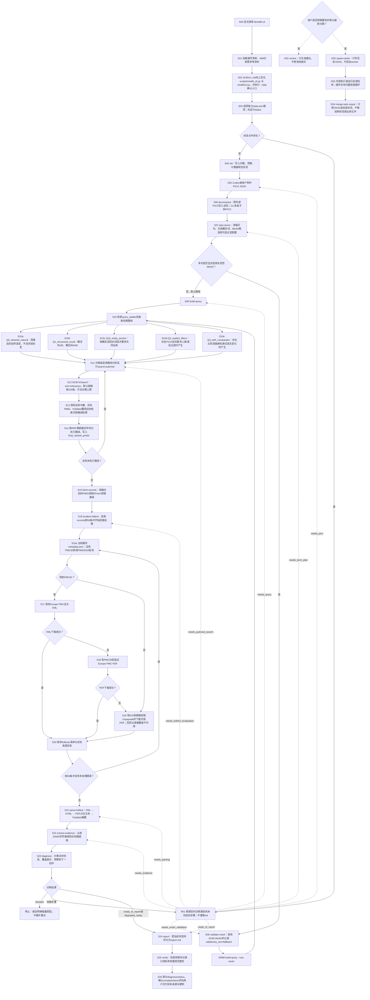

# MedLit CLI 当前系统拆解与审计

## 1. 完整设计流程图



图中实线是默认设计主链；虚线是恢复跳转、显式MeSH或非默认辅助路径。`status/diagnose`给出下一步，但不会替Codex自动执行命令。

---

## 2. 审计边界：系统究竟由谁控制

当前插件不是一个独立运行的医学检索机器人，而是“Codex负责决策，Python CLI负责确定性操作，JSON状态负责串联”的混合系统。

| 层 | 真实职责 | 不负责什么 | 主要入口 |
|---|---|---|---|
| 插件层 | 让Codex发现并加载MedLit Skill，声明读、写、网络能力 | 不提供MCP服务，不直接执行检索 | [plugin.json](../plugins/medlit-cli/.codex-plugin/plugin.json) |
| Skill契约层 | 规定命令顺序、来源纪律、何时停止、何时读取参考资料 | 不实现PICO算法、检索或解析 | [SKILL.md](../plugins/medlit-cli/skills/medlit-cli/SKILL.md) |
| Codex控制层 | 选择工作目录、制作PICO JSON、调用每个命令、检查结果、决定是否继续 | 不能把CLI占位输出当成医学事实 | [openai.yaml](../plugins/medlit-cli/skills/medlit-cli/agents/openai.yaml) |
| CLI编排层 | 解析命令、调用模块、更新状态、返回退出码 | 没有持续自主循环，也没有真正的worker调度器 | [cli.py](../plugins/medlit-cli/medlit/cli.py) |
| 业务模块层 | 词语规划、PubMed访问、融合、全文定位、解析、证据初稿、诊断和报告 | 不做医学正确性验证 | [medlit/](../plugins/medlit-cli/medlit) |
| 状态层 | 保存所有中间产物、错误、预算和来源信息 | 不自动判断内容是否医学可信 | [store.py](../plugins/medlit-cli/medlit/state/store.py) |

插件设置为 `allow_implicit_invocation: false`，因此设计上应由用户显式调用 `$medlit-cli`。入口调用链是：

```text
Codex
  → plugins/medlit-cli/scripts/medlit_cli.py
  → medlit.cli.main()
  → 某个cmd_*处理函数
  → 业务模块
  → state.json
```

CLI标准输出是JSON，进度提示写到标准错误。系统没有使用Biopython、EDirect或其他PubMed SDK；网络层使用Python标准库 `urllib` 直接访问NCBI E-utilities、PMC ID Converter、Europe PMC和Unpaywall。

### 流程图判断与恢复节点

| 编号 | 判断内容 | 确定的处理原则 |
|---|---|---|
| D01 | 研究状态是否已经存在 | 已存在则恢复，不存在才初始化；CLI不会替用户保护已有文件 |
| R01 | 恢复到哪一步 | 依据 `status/diagnose` 的实时建议跳到未完成阶段，不重做已完成阶段 |
| D02 | 是否使用MeSH | 默认否；只有显式实验才进入S08和S09M |
| D03 | 是否还有未执行的检索路线 | 有则继续逐路搜索；没有才获取题录 |
| D04 | Europe PMC XML是否成功 | 成功即停止该篇的PDF尝试；失败才进入S18 |
| D05 | Europe PMC PDF是否成功 | 成功即保存；失败才考虑Unpaywall或摘要 |
| D08 | 当前题录是否有PMCID | 有则先走Europe PMC XML/PDF；没有则直接考虑DOI/Unpaywall |
| D07 | 前50条题录是否处理完 | 未完成则转到下一篇的S16a，完成后统一进入解析 |
| D06 | 诊断结果是什么 | 阻塞则停止；缺步骤则恢复；证据可报告则进入S24 |
| U00 | 用户是否明确要求辅助命令 | 未明确要求时，O01—O04不进入默认工作流 |

---

## 3. S00—S04：加载、入口确认与状态初始化

| 编号 | 设计要求与Codex应有行为 | 代码的确定行为 | 可检查结果 |
|---|---|---|---|
| S00 | 用户显式调用 `$medlit-cli`，Codex才进入该流程 | [openai.yaml](../plugins/medlit-cli/skills/medlit-cli/agents/openai.yaml) 第7行禁止隐式调用 | 新对话中应显示来自正确插件缓存的Skill |
| S01 | 加载主Skill；进入检索、全文或异常阶段时才读取相应参考文件 | [SKILL.md](../plugins/medlit-cli/skills/medlit-cli/SKILL.md) 的“Supporting references”规定按需读取；文件位于Skill自身的 `references/` | 安装缓存中应同时存在SKILL和4份参考资料 |
| S02 | 从 `SKILL.md` 所在位置向上查找同时包含 `scripts/medlit_cli.py` 与 `medlit/cli.py` 的目录，再用绝对路径运行 `--help` | [medlit_cli.py](../plugins/medlit-cli/scripts/medlit_cli.py) 第1行是启动脚本；[cli.py](../plugins/medlit-cli/medlit/cli.py) 第26行是 `main`，第40行是命令解析器 | `--help`应列出17个子命令；找不到入口应停止而非猜路径 |
| S03 | 为每项研究选择独立的 `state.json`；已有状态先 `status`，不能直接 `init` 覆盖 | [cli.py](../plugins/medlit-cli/medlit/cli.py) 第389行 `cmd_status` 每次重新调用 `Diagnoser`，不会信任旧的 `state.diagnostics` | 无状态时返回 `no_state/next:init`；有状态时返回实时下一步 |
| S04 | 仅在无状态时运行 `init --question` | [cli.py](../plugins/medlit-cli/medlit/cli.py) 第94行 `cmd_init` 调用 [store.py](../plugins/medlit-cli/medlit/state/store.py) 第41行 `StateStore.init`；如果路径已有文件，会直接覆盖 | `schema_version=medlit-state/v0.1`，并生成空PICO、预算、计数器等 |

初始化默认值对后续实验很重要：

| 配置 | 默认值 | 实际用途 |
|---|---:|---|
| `max_pubmed_queries` | 6 | 无题录且累计检索调用达到6次时，诊断为阻塞 |
| `max_records` | 50 | 全文定位只处理 `records` 的前50条 |
| `max_fulltext_attempts` | 30 | 仅在尚无任何 `fulltexts` 清单时参与诊断 |
| `max_same_blocker` | 2 | 同类阻塞累计达到2次后可成为硬阻塞 |
| `max_rounds` | 3 | 当前只写入状态，代码没有消费或递增它 |
| RRF `k` | 60 | 初始化记录值；真正融合时以每次 `search-pubmed --rrf-k` 为准 |

**审计提醒：** `init`是覆盖操作，不是“如果不存在则创建”。保护已有研究状态依赖Codex遵守S03，而不是CLI自身防误操作。

---

## 4. S05—S07：PICO输入与检索词规划

### S05：PICO由Codex或用户生成

CLI没有PICO拆分模型，也没有本地启发式拆解命令。Codex应根据问题制作UTF-8 JSON，核心键为：

```json
{
  "question": "原始问题",
  "population": "研究人群或疾病背景",
  "intervention_or_exposure": "干预、药物或暴露",
  "comparator": "比较措施，可以为空",
  "outcome": "关注结局",
  "filters": {
    "humans": true,
    "language": "english"
  }
}
```

`filters`不是默认字段，只有研究方案明确要求时才应加入。当前状态机只在 `population`、`intervention_or_exposure`、`outcome` 三者**全部为空**时阻塞；它不会保证PICO拆得合理，也不要求三个字段都非空。因此“一整道问题全部放进population”在代码上仍然合法。

### S06：`decompose`只是导入，不是拆解

对应源码：[cli.py](../plugins/medlit-cli/medlit/cli.py) 第102行 `cmd_decompose`。

- 有 `--pico-file`：读取JSON并原样写入 `state.pico`。
- 没有文件：记录 `codex_required` blocker，退出码8。
- 不检查键名、类型、医学合理性或与原始问题的一致性。
- 单独重跑 `decompose` 不会清除旧 `term_plan`、检索结果、题录或证据；设计链要求紧接着重跑S07。

### S07：`plan-terms`究竟做什么

对应源码：[cli.py](../plugins/medlit-cli/medlit/cli.py) 第126行 `cmd_plan_terms`，以及 [query.py](../plugins/medlit-cli/medlit/pubmed/query.py) 第92行 `TermPlanner`、第95行 `plan`。

1. 依次读取四个PICO字段，空字段跳过。
2. 用规则删除疑问句开头，例如 `What is`、`Does`、`Describe`；并保留清理后的整句作为自然语言路线输入。
3. 用普通停用词、疑问词和内置泛词表切断词组，防止生成 `"Plozasiran reduce"` 之类错误短语。
4. 每段最多保留4词短语；长段还会尝试2词、3词片段和具有数字、连字符、大小写混合等特征的单词。
5. 仅对少量模式写有硬编码扩展：2型糖尿病、GLP-1/司美格鲁肽、PDE5、半衰期。
6. `mesh_terms`只是把上述词语改成标题式大小写后作为**待验证候选**，不是已经查证的MeSH词。
7. 保存PICO中的显式过滤配置。

运行S07会清空旧MeSH验证、MeSH完成标记、检索路线和旧诊断快照，但**不会清空**旧 `retrieval_runs`、`final_ranked_pmids`、`records`、全文、证据或报告。这是后续重新规划实验必须重点防范的状态污染点。

---

## 5. S08—S10：MeSH分支与多条检索路线

### S08：实验性MeSH验证

默认流程跳过此步。只有明确测试MeSH时才运行 `validate-mesh`，之后必须使用 `build-query --use-mesh`。

对应源码：[cli.py](../plugins/medlit-cli/medlit/cli.py) 第142行 `cmd_validate_mesh`；[mesh.py](../plugins/medlit-cli/medlit/pubmed/mesh.py) 第16行 `MeshValidator`。

`MeshValidator`对每个候选执行：

```text
NCBI ESearch(db=mesh)
  → 最多取5个ID
  → ESummary
  → 候选与首选词完全一致：valid
  → 候选与入口词完全一致：entry_term
  → 其他或请求失败：fallback
```

只有 `valid` 和 `entry_term` 会进入 `[MeSH Terms]` 检索。失败不会阻断默认工作流；即使候选数为0，只要验证命令已执行，`mesh_validation_status.completed=true`，状态机也认为验证阶段完成。

### S09：构建检索式

对应源码：[cli.py](../plugins/medlit-cli/medlit/cli.py) 第160行 `cmd_build_query`；[query.py](../plugins/medlit-cli/medlit/pubmed/query.py) 第201行 `QueryBuilder`、第204行 `build`。

`cmd_build_query`先把是否启用MeSH写入 `query_configuration`。如果使用 `--use-mesh` 但验证尚未完成，会清空 `query_ladder`、退出码5，并把下一步指向S08。

### S10：每条路线的真实构造逻辑

对应源码集中在 [query.py](../plugins/medlit-cli/medlit/pubmed/query.py) 第204行 `QueryBuilder.build`；锚点选择单独位于第255行 `_anchor_query`。

| 编号/路线 | 产生条件 | 真实构造方式 | 它在防什么 | 它可能引入什么问题 |
|---|---|---|---|---|
| S10a `Q0_cleaned_natural` | 有原始问题或可识别的整句输入 | 只做轻度问句清理，不加字段标签 | PICO或词语规划错误时仍保留原始语境，并让PubMed自动术语映射工作 | 问句中的普通词仍可能带来噪声 |
| S10b `Q1_structured_recall` | 至少一个概念产生有效词 | 同一PICO概念内用OR；可用的P、I、O概念块之间用AND；显式MeSH模式下再加入验证成功的MeSH词 | 去掉问句噪声并集中医学概念 | 当P、I、O都填写得很细时仍可能过度约束 |
| S10c `Q1b_entity_anchor` | 选出的锚点式与S10b不同 | 每个P/I/O概念按词数和长度选择最多2个较长词组；概念内、概念间都用AND | 让稀有药物、基因或命名方法与主题共同出现 | 它不是医学实体识别器；“较长词组”可能只是结局短语，而且通常比S10b更严格 |
| S10d `Q2_explicit_filters` | 明确配置 `humans=true` 或语言 | 在S10b后追加人类MeSH或语言字段 | 执行研究方案明确要求的限制 | 会牺牲召回，因此默认不产生 |
| S10e `Q3_with_comparator` | comparator非空且生成式不同 | 在P、I、O之外再AND比较措施 | 找到明确比较研究 | 比较措施写法变化时容易漏检 |

需要特别区分：多条路线不是五种不同搜索引擎，而是五种PubMed检索表达。每条路线仍然调用同一个NCBI ESearch。

---

## 6. 用代表问题理解路线生成

### 问题A：完整PICO、比较措施和显式过滤

> 在成人难治性高血压患者中，与诊室血压监测相比，家庭血压监测是否改善血压控制？

建议冻结输入：

```json
{
  "population": "adults with resistant hypertension",
  "intervention_or_exposure": "home blood pressure monitoring",
  "comparator": "office blood pressure monitoring",
  "outcome": "blood pressure control",
  "filters": {"humans": true, "language": "english"}
}
```

预期可产生S10a—S10e全部五条路线。它适合测试：比较措施是否过度约束、显式过滤造成多少召回损失、五路RRF是否被弱路线稀释。

### 问题B：稀有药物实体

> Does Plozasiran reduce triglyceride levels?

如果整题暂时只放入population，规划器应至少把 `Plozasiran` 与普通动词 `reduce` 分开。通常会形成自然语言、结构化OR和共同出现锚点三条路线。它适合验证：关键药名是否保留、泛词是否仍进入结构化路线、锚点路线是否确实增加独有标准答案论文。

### 问题C：常见疾病、药物和结局

> Does semaglutide reduce cardiovascular events in adults with type 2 diabetes?

冻结P、I、O后且不设置比较和过滤，重点观察自然语言、结构化和锚点路线。它还会触发内置的2型糖尿病及GLP-1相关扩展，适合检验硬编码扩展到底增加相关论文还是只增加噪声。

### 问题D：MeSH开关对照

> In adults with asthma, do inhaled corticosteroids reduce exacerbations?

固定同一份PICO，分别执行：

```text
plan-terms → build-query
plan-terms → validate-mesh → build-query --use-mesh
```

除此之外保持路线深度、日期和评测集合一致。这样测到的差异才属于MeSH，而不是PICO重新生成带来的差异。

### 问题E：最低合法PICO

只填写 `population`，其余P/I/O为空。当前状态机允许继续。它不是推荐输入，而是用来证明“通过状态机”不等于“表示质量合格”，并测试Codex是否会在代码阻塞之前主动发现输入过粗。

---

## 7. S11—S15：PubMed检索、RRF与题录获取

### S11—S13：每次命令只执行一条路线

对应源码：[cli.py](../plugins/medlit-cli/medlit/cli.py) 第194行 `cmd_search_pubmed`、第442行 `_select_query`；[client.py](../plugins/medlit-cli/medlit/pubmed/client.py) 第23行 `PubMedClient.search`。

`search-pubmed --query-id <id>`选择指定路线；未给ID时选择第一条尚未执行的路线。如果所有路线都已执行，再次不带ID运行会重跑第一条路线。每次调用都会增加 `counters.pubmed_queries`，即使是重跑或没有返回PMID。

### S12：实际PubMed请求

对应 [client.py](../plugins/medlit-cli/medlit/pubmed/client.py) 的 `PubMedClient.search`：

```text
GET https://eutils.ncbi.nlm.nih.gov/entrez/eutils/esearch.fcgi
db=pubmed
term=<路线检索式>
retmax=100（默认，可改）
retmode=json
sort=relevance
```

因此每条路线的内部顺序首先来自PubMed relevance排序。`--max-date`不是恢复历史数据库快照，而是在当前PubMed检索式上追加发表日期范围。保存内容包括总命中数 `count`、实际返回PMID、有效检索式、PubMed `querytranslation` 与 `translationset`。

### S14：RRF如何产生最终PMID顺序

对应源码：[fusion.py](../plugins/medlit-cli/medlit/retrieval/fusion.py) 第8行 `reciprocal_rank_fusion`；调用位置在 [cli.py](../plugins/medlit-cli/medlit/cli.py) 第194行的 `cmd_search_pubmed` 内。

每执行完一条路线，系统都会用全部 `retrieval_runs` 重新计算：

```text
某PMID的总分 = Σ 1 / (k + 它在该路线中的名次)
默认 k = 60
```

同一PMID在同一路线重复只计一次；出现在多条路线会累加。所有路线权重相同，没有根据路线质量自动加权。并列时依次比较：最佳单路名次、首次出现的路线及名次、PMID。重跑同一 `query_id` 会替换旧结果，不会给该路线双重权重。

RRF解决的是“后执行路线也能影响最终排序”，但不证明所有路线都值得保留，也不等同于相关性重排模型。

### S15：获取题录

对应源码：[cli.py](../plugins/medlit-cli/medlit/cli.py) 第248行 `cmd_fetch_records`；[client.py](../plugins/medlit-cli/medlit/pubmed/client.py) 第45行 `fetch_records`、第54行 `parse_records`。

`fetch-records`优先使用 `final_ranked_pmids`；旧状态没有融合结果时才顺序合并各路线，再退回 `last_pmids`。随后通过PubMed EFetch XML获取：

- PMID、PMCID、DOI；
- 标题、摘要、期刊、年份、作者；
- PubMed已标引的MeSH词和文献类型；
- 摘要中匹配到的NCT临床试验编号。

这些是题录与摘要信息，不是全文。`verified_by=pubmed`只说明记录来自PubMed，不说明论文结论正确。

**顺序审计点：** 代码把融合PMID按顺序交给EFetch，但没有在解析返回XML后再次按 `final_ranked_pmids` 显式排序；如果已有旧records，`replace_by_key`还会保留原列表位置。全文阶段处理的前50条因此不一定被代码强制证明为当前融合排名前50条。

---

## 8. S16—S20：开放全文定位

对应源码：[cli.py](../plugins/medlit-cli/medlit/cli.py) 第283行 `cmd_localize_fulltext`；[localizer.py](../plugins/medlit-cli/medlit/fulltext/localizer.py) 第23行 `FulltextLocalizer`、第27行 `localize_records`、第33行 `localize`。每篇记录先创建：

各外部来源的具体入口分别是：第78行 `_lookup_pmcid`、第94行 `_try_europe_pmc_xml`、第109行 `_try_europe_pmc_pdf`、第124行 `_try_unpaywall_pdf`。

```text
<state目录>/papers/<PMID或DOI>/
├─ metadata.json
├─ fulltext.xml   # 仅XML成功时
└─ paper.pdf      # 仅PDF成功时
```

| 编号 | 条件与行为 | 成功标记 | 失败后的去向 |
|---|---|---|---|
| S16 | 取 `records` 前 `max_records=50`，建立逐篇处理循环 | 确定本次需要尝试定位的记录集合 | S16a |
| S16a | 写题录；已有PMCID直接用，否则通过PMC ID Converter用PMID优先、DOI次之查PMCID | 得到PMCID或记录miss/failed | S17或S19 |
| S17 | 有PMCID时请求Europe PMC `fullTextXML` | `xml_downloaded`，立即停止该篇后续尝试 | S18 |
| S18 | 有PMCID且XML失败时请求Europe PMC PDF | 字节以 `%PDF-` 开头且大于10000字节，记 `pdf_downloaded` | S19 |
| S19 | 有DOI且设置 `UNPAYWALL_EMAIL` 或 `MEDLIT_EMAIL` 时查询开放位置，再下载 `url_for_pdf` | 同样验证PDF头和大小 | 有摘要则 `abstract_only`，否则 `unavailable` |
| S20 | 把每一步写入 `sources_tried`，保存本地文件路径、许可证和访问日期 | `fulltexts[]` | 进入解析 |

网络异常在各来源内部被捕获并写入清单，所以即使全部失败，`localize-fulltext`通常仍退出0。它的成功只表示“完成尝试”，不表示下载成功。

当前命令声称处理最多50条，但 `fulltext_attempts` 增加的是 `len(records)` 而不是实际处理数量；当题录超过50条时，该计数会高估真实尝试次数。

---

## 9. S21：正文解析的真实优先级

对应源码：[cli.py](../plugins/medlit-cli/medlit/cli.py) 第304行 `cmd_parse_fulltext`；[parser.py](../plugins/medlit-cli/medlit/fulltext/parser.py) 第14行 `FulltextParser`、第22行 `parse_one`：

| 选择顺序 | `parse_method` | 实际输出 | 能否作为正文证据 |
|---:|---|---|---|
| 1 | `xml` | 用ElementTree读取文章标题、章节和段落，写 `parsed_text.md` | 可以，但仍需人工检查结构和重复内容 |
| 2 | `html` | 正则去除脚本、样式和标签后写纯文本 | 可以，但默认定位器从不下载HTML；正常主链几乎到不了此分支 |
| 3 | `pdf_placeholder` | 只写“PDF保存在某路径”，不读取PDF内容 | 不可以 |
| 4 | `abstract` | 把PubMed标题与摘要写入文本 | 只能作为摘要级证据 |
| 5 | `unavailable` | 没有文本文件 | 不可以 |

这里存在已确认的契约缺口：PDF文件存在时，解析器优先生成占位文本，不会自动回退到已有PubMed摘要；占位文本还被标成 `source_granularity=fulltext` 和 `status=parsed`。Skill要求Codex排除它，但代码没有强制排除。

---

## 10. S22：所谓“证据提取”到底做了什么

对应源码：[cli.py](../plugins/medlit-cli/medlit/cli.py) 第316行 `cmd_extract_evidence`；[evidence.py](../plugins/medlit-cli/medlit/extraction/evidence.py) 第25行 `EvidenceExtractor`、第28行 `extract`、第42行 `_extract_one`。它不是语言模型总结，也不是医学证据质量评价，而是对每份 `parsed_text.md` 前20000字符做规则式初稿：

- 根据PubMed文献类型和关键词猜研究设计；
- 找第一句包含患者、人群等关键词的句子；
- 优先找Methods、Results、Limitations章节，否则找含相应关键词的句子；
- 用正则提取HR、OR、RR、95% CI、p值、百分比和 `N=`；
- `matched_pico`当前始终为空；
- 只要文本文件存在，通常就写 `extraction_status=ok`。

因此PDF占位文本也可能得到 `ok`，诊断器随后会把它计为有效证据。Codex应在S22后逐条检查 `parse_method`、`source_granularity` 与本地文件，不能只看提取成功计数。

---

## 11. S23：状态机如何决定下一步

对应源码：[cli.py](../plugins/medlit-cli/medlit/cli.py) 第328行 `cmd_diagnose`；[diagnostics.py](../plugins/medlit-cli/medlit/evolution/diagnostics.py) 第10行 `Diagnoser`、第13行 `diagnose`。判断按以下优先顺序进行，先命中的条件会遮住后续条件：

| 顺序 | 条件 | 诊断状态 | 建议动作 |
|---:|---|---|---|
| 1 | 检索前存在硬阻塞且无records | `blocked` | 修复环境或配置 |
| 2 | 没有PICO | `needs_pico` | `decompose` |
| 3 | P、I、O全部为空 | `needs_question_clarification` | 请用户澄清 |
| 4 | 没有概念词规划 | `needs_term_plan` | `plan-terms` |
| 5 | 显式MeSH模式且验证未完成 | `needs_mesh_validation` | `validate-mesh` |
| 6 | 没有检索路线 | `needs_query` | `build-query`或保留MeSH开关 |
| 7 | 无records且检索调用达到预算 | `blocked` | 报告失败 |
| 8 | 无records | `needs_pubmed_search` | 搜索并获取题录 |
| 9 | 无全文清单且尝试计数达到预算 | `fulltext_budget_exhausted` | `parse-fulltext` |
| 10 | 无全文清单 | `needs_fulltext_localization` | `localize-fulltext` |
| 11 | 没有任何 `status=parsed` | `needs_parsing` | `parse-fulltext` |
| 12 | 没有任何 `extraction_status=ok` | `needs_evidence` | `extract-evidence` |
| 13 | 有证据但无报告路径 | `ready_to_report` | `report`、`verify` |
| 14 | 已有报告路径 | `complete` | 无 |

硬阻塞包括：同类blocker累计达到 `max_same_blocker`、缺少必需配置/依赖，以及在没有records时出现网络不可用。blocker没有自动清除机制；如果后来已有records并有证据，历史硬阻塞可能把状态改成 `degraded_ready`。

`coverage`并不是召回率。它只是检查PICO字段中的长度大于2的空格分词，是否有任意一个出现在检索式或证据对象字符串中。这对英文尚且粗糙，对中文几乎没有可靠的医学含义，不能作为检索质量指标。

---

## 12. S24—S26：报告、校验与结束

### S24 `report`

对应源码：[cli.py](../plugins/medlit-cli/medlit/cli.py) 第362行 `cmd_report`；[report.py](../plugins/medlit-cli/medlit/report.py) 第11行 `ReportWriter`、第14行 `write`。它将当前状态机械写成 `report.md`，包括问题、PICO、记录数、全部证据项、阻塞项和检索审计。它不会重新阅读论文、综合结论或排除PDF占位证据；如果之前没有重新运行 `diagnose`，报告还可能读取旧诊断快照。

### S25 `verify`

对应源码：[cli.py](../plugins/medlit-cli/medlit/cli.py) 第374行 `cmd_verify`；[report.py](../plugins/medlit-cli/medlit/report.py) 第70行 `Verifier`、第71行 `verify`。

当前校验只做两类检查：

1. 某证据引用不在records中，并且该证据连标题也没有；
2. 标成全文的证据没有本地来源路径。

它不检查报告文件是否存在、不检查PDF是否解析、不检查PMID与标题是否匹配、不判断研究质量、事实正确性或医学适用性。`verify.ok=true`只能理解为“没有触发这两条有限规则”。

### S26 最终状态

对应源码仍是 [cli.py](../plugins/medlit-cli/medlit/cli.py) 第328行 `cmd_diagnose`；若只查看实时状态，则是第389行 `cmd_status`。

报告后再运行 `diagnose`，若诊断认为完成，`cmd_diagnose`把 `state.status` 设为 `done`。最终向用户交付时必须说明每条证据实际来自XML全文、摘要还是不可用来源，并明确仍存在的阻塞或降级。

---

## 13. O01—O04：不属于默认主链的命令

对应源码：[cli.py](../plugins/medlit-cli/medlit/cli.py) 第350行 `cmd_evolve`、第420行 `cmd_spawn_tasks`、第431行 `cmd_merge_task_output`；具体建议逻辑在 [strategy.py](../plugins/medlit-cli/medlit/evolution/strategy.py) 第10行，任务文件逻辑在 [tasks.py](../plugins/medlit-cli/medlit/agents/tasks.py) 第12行。

| 编号 | 命令 | 当前真实能力 | 不能声称的能力 |
|---|---|---|---|
| O01 | `evolve` | 根据记录数、粗略覆盖和全文命中率，向 `evolution_memory` 追加文字建议 | 不修改PICO、词语计划或检索式，不自动开始下一轮 |
| O02 | `spawn-tasks` | 根据状态在 `<state目录>/tasks/` 写 `task_*.json` | 不创建Codex子代理，不并行执行，不监控、不重试 |
| O03 | 外部执行 | 需要Codex或其他执行者另行完成 | 插件内部没有worker运行时或orchestrator |
| O04 | `merge-task-output` | 读取任意JSON并追加到 `state.task_outputs` | 不校验结构，不把结果合并进records/evidence，也不验证来源 |

这些命令只有用户明确要求实验时才应使用，不能画进默认“自动并行工作流”。

---

## 14. 网络、缓存、身份和退出码

### 网络层

对应源码：[http.py](../plugins/medlit-cli/medlit/http.py) 第32行 `HttpClient`、第69行 `_fetch`、第141行 `ssl_context`、第200行 `ncbi_identity`。默认超时30秒、重试1次；HTTP 429会等待后重试。可配置：

- `MEDLIT_EMAIL` / `NCBI_EMAIL`：NCBI调用身份；
- `NCBI_API_KEY`：可选NCBI密钥；
- `UNPAYWALL_EMAIL`：Unpaywall身份；
- `MEDLIT_CACHE_DIR`：按URL哈希缓存响应；
- `MEDLIT_CA_BUNDLE`：自定义CA证书；
- `MEDLIT_SSL_VERIFY=0`：关闭证书校验，存在安全风险，不应作为默认修复。

缓存键会去掉邮箱、工具名和API key，因此相同业务请求可共享缓存。如果为复现实验启用缓存，应记录缓存目录和清理策略；否则缓存命中可能掩盖远端数据变化。

### 主要退出码

| 退出码 | 含义 |
|---:|---|
| 0 | 命令执行完成；不等于检索、全文或医学结论成功 |
| 3 | 状态文件等路径不存在 |
| 5 | 缺少前置数据、MeSH阶段未完成或检索无PMID |
| 6 | 远程API返回或解析错误 |
| 7 | 网络不可用 |
| 8 | 工作流阻塞或PICO必须由Codex提供 |
| 9 | 有限的引用完整性校验失败 |
| 130 | 用户中断 |

---

## 15. 状态字段与产物依赖图

```text
question
  └─ pico
      └─ term_plan
          ├─ mesh_validation（仅实验路径）
          └─ query_ladder
              └─ retrieval_runs
                  └─ final_ranked_pmids
                      └─ records
                          └─ fulltexts + papers/<id>/metadata/XML/PDF
                              └─ parsed_sources + parsed_text.md
                                  └─ evidence
                                      └─ diagnostics
                                          └─ report.md
                                              └─ verification
```

这是一条逻辑依赖链，但当前代码只对部分上游变化执行失效清理。因此修改PICO、词语计划或路线后，不能假设所有下游数据自动失效。

---

## 16. 已确认、值得优先测试的逻辑缺口

| 编号 | 已确认事实 | 为什么影响后续实验 | 最小验证方法 |
|---|---|---|---|
| A1 | 重做PICO/term plan不会清空旧retrieval、records、evidence和report | 新旧方案可能混在同一state，产生虚假提升 | 同一state先跑五路，再改成三路，检查旧Q2/Q3是否仍参与RRF；与全新state对照 |
| A2 | 锚点路线按词数/长度选词，不做医学实体识别 | “核心实体路线”名称可能让人高估其语义能力 | 对每题人工标出真正实体，与锚点词组逐题比较 |
| A3 | PDF占位文本被标成已解析全文，规则提取还可能返回ok | 全文率、证据数和终止状态可能被虚高 | 构造只有PDF和摘要的记录，检查parse、extract、diagnose和report |
| A4 | records顺序没有在EFetch后显式按融合排名恢复 | 前50篇全文定位可能不严格对应融合前50 | 打乱模拟EFetch返回顺序，检查records与全文处理顺序 |
| A5 | 全文尝试计数按全部records增加，而定位最多处理50条 | 成本统计与实际请求数不一致 | 用51条以上假记录运行本地替身测试 |
| A6 | `verify`规则很弱 | 通过校验容易被误解为医学报告可信 | 放入有标题但PMID不存在的证据，观察是否仍通过 |
| A7 | `max_rounds`和`counter.round`目前未参与流程 | 文档中若声称“最多三轮自动迭代”就是错误 | 全仓搜索字段读写位置 |
| A8 | HTML解析分支存在，但默认全文定位从不产生HTML | 测试覆盖代码分支不等于产品主链具备HTML采集 | 完整黑盒流程检查 `local_files.html` |
| A9 | `status`实时计算但不保存；`report`读取保存的旧diagnostics | 报告状态可能落后于实际状态 | 完成新步骤后只运行status再report，与先diagnose对照 |
| A10 | 日期上限只是当前PubMed上的日期条件 | 不能据此声称复现历史BioASQ固定语料 | 同日期条件比较历史快照与当前在线PubMed（需要另备快照） |

---

## 17. 面向消融实验的最小测试矩阵

为了不让多个变化相互混淆，每组实验应冻结问题集合、PICO JSON、PubMed时间条件、每路深度和评分程序，并使用全新state。

| 实验 | 只改变什么 | 至少比较什么 | 能回答的问题 |
|---|---|---|---|
| E1 自然语言路线 | 有/无S10a | 按问题平均的Recall@10/100、Hit@10、MAP@10 | PubMed自动映射和原始语境是否补回结构化路线漏检 |
| E2 结构化路线 | 有/无S10b | 同上，并逐题列独有命中 | 清理后的PICO概念是否真正有增益 |
| E3 锚点路线 | 有/无S10c | 独有标准答案论文、前10误命中案例 | 目前“最长词组共同出现”是帮助还是过度约束 |
| E4 比较/过滤路线 | S10d、S10e分别开关 | 召回变化、前10准确性、被过滤标准答案 | 这些严格路线是否应参与等权RRF |
| E5 MeSH | 同PICO下默认路径与显式MeSH路径 | 有效MeSH数、独有命中、总召回和MAP | 当前MeSH候选质量是否值得投入 |
| E6 候选深度 | 20/50/100/200/500 | Recall@K增益与请求、题录、全文成本 | 默认100是否是合理折中 |
| E7 融合 | 顺序拼接、RRF、单路最佳 | MAP@10、Hit@10、各路对前10贡献 | RRF解决结构性问题后是否仍被弱路线稀释 |
| E8 PICO表示 | 冻结人工PICO与Codex现场PICO | 分别报告表示差异和检索差异 | 召回变化来自表示还是检索器 |
| E9 全文链 | XML、PDF、摘要分层统计 | 定位率、真正可解析全文率、可用证据率 | “下载成功”与“正文可用”之间损失多少 |
| E10 状态隔离 | 复用state与全新state | 最终路线、PMID和records差异 | A1状态污染是否影响既往评测 |

检索评测和全文/证据评测必须分开：前者衡量是否找回正确论文及其排名，后者衡量找到论文后能否获得并解析可用内容。不能用“证据条目数”替代论文召回率，也不能用 `verify.ok` 替代医学正确性。

---

## 18. 一次可追溯测试应保存什么

每次实验至少保留：

1. 插件版本与Git提交；
2. 原始问题和冻结PICO JSON；
3. 是否启用MeSH、过滤、日期上限、每路深度和RRF参数；
4. `term_plan` 与完整 `query_ladder`；
5. 每路 `effective_query`、PubMed翻译、总命中数和PMID顺序；
6. `final_ranked_pmids`；
7. 评分所用的标准答案来源与时间条件；
8. 每篇全文的 `sources_tried`、解析方法和实际本地文件；
9. 失败、阻塞、缓存目录及是否使用在线PubMed；
10. 全新state还是复用state。

只有这些信息齐全，后续才能判断某项改动究竟改善了问题表示、检索式、候选深度、融合、全文获取，还是只是改变了运行环境。

---

## 19. 步骤—代码索引

这张表用于从流程图直接跳回实现。标为“Codex契约”的步骤没有独立算法代码，其正确性依赖Skill被正确执行。

| 步骤 | 直接实现或契约位置 | 核心函数/规则 |
|---|---|---|
| S00 | `skills/medlit-cli/agents/openai.yaml` | `allow_implicit_invocation: false` |
| S01 | `skills/medlit-cli/SKILL.md`及其 `references/` | Skill加载和按阶段读取规则 |
| S02 | `scripts/medlit_cli.py`、`medlit/__main__.py`、SKILL执行路径 | 插件根定位属于Codex契约；脚本调用 `medlit.cli.main` |
| S03 | `medlit/cli.py` | `cmd_status`；实时调用 `Diagnoser.diagnose` |
| S04 | `medlit/cli.py`、`medlit/state/store.py` | `cmd_init`、`StateStore.init` |
| S05 | `SKILL.md` | Codex契约；CLI没有PICO生成器 |
| S06 | `medlit/cli.py` | `cmd_decompose` |
| S07 | `medlit/cli.py`、`medlit/pubmed/query.py` | `cmd_plan_terms`、`TermPlanner.plan` |
| S08 | `medlit/cli.py`、`medlit/pubmed/mesh.py` | `cmd_validate_mesh`、`MeshValidator` |
| S09/S09M | `medlit/cli.py`、`medlit/pubmed/query.py` | `cmd_build_query`、`QueryBuilder.build` |
| S10a | `medlit/pubmed/query.py` | `clean_natural_query`、`Q0_cleaned_natural` |
| S10b | `medlit/pubmed/query.py` | `blocks_by_concept`、`Q1_structured_recall` |
| S10c | `medlit/pubmed/query.py` | `QueryBuilder._anchor_query` |
| S10d | `medlit/pubmed/query.py` | `cfg_filters`、`Q2_explicit_filters` |
| S10e | `medlit/pubmed/query.py` | `comparator_base`、`Q3_with_comparator` |
| S11 | `medlit/cli.py` | `_select_query`、`cmd_search_pubmed` |
| S12 | `medlit/pubmed/client.py` | `PubMedClient.search`、ESearch |
| S13 | `medlit/cli.py` | 构造 `retrieval_run`，保存翻译和计数 |
| S14 | `medlit/retrieval/fusion.py` | `reciprocal_rank_fusion` |
| S15 | `medlit/cli.py`、`medlit/pubmed/client.py` | `cmd_fetch_records`、`fetch_records`、`parse_records` |
| S16/S16a | `medlit/fulltext/localizer.py` | `localize_records`、`localize`、`_lookup_pmcid` |
| S17 | `medlit/fulltext/localizer.py` | `_try_europe_pmc_xml` |
| S18 | `medlit/fulltext/localizer.py` | `_try_europe_pmc_pdf` |
| S19 | `medlit/fulltext/localizer.py` | `_try_unpaywall_pdf`及摘要/不可用回退 |
| S20 | `medlit/cli.py` | `cmd_localize_fulltext`写入 `state.fulltexts` |
| S21 | `medlit/fulltext/parser.py` | `FulltextParser.parse_one`及XML/HTML/PDF占位分支 |
| S22 | `medlit/extraction/evidence.py` | `EvidenceExtractor.extract`、`_extract_one` |
| S23 | `medlit/evolution/diagnostics.py`、`medlit/cli.py` | `Diagnoser.diagnose`、`cmd_diagnose` |
| S24 | `medlit/report.py`、`medlit/cli.py` | `ReportWriter.write`、`cmd_report` |
| S25 | `medlit/report.py`、`medlit/cli.py` | `Verifier.verify`、`cmd_verify` |
| S26 | `medlit/cli.py` | `cmd_diagnose`更新 `state.status`；`cmd_status`给实时视图 |
| O01 | `medlit/evolution/strategy.py` | `StrategyEvolver.evolve` |
| O02 | `medlit/agents/tasks.py` | `TaskQueue.spawn_tasks` |
| O03 | 无内部执行代码 | 必须由Codex或外部执行者完成 |
| O04 | `medlit/agents/tasks.py` | `TaskQueue.merge_output` |
