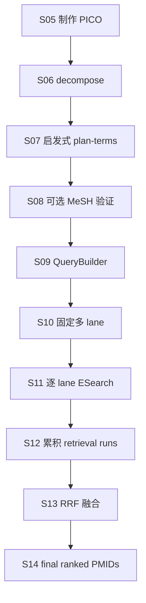
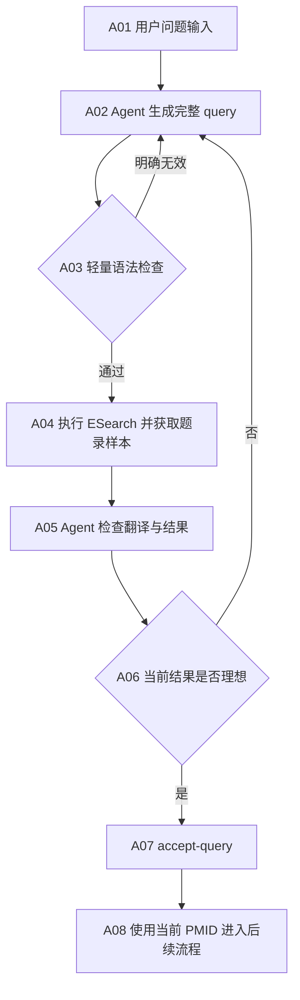

# PubMed Agent 检索改造计划

## 一、问题分析

- 现有 S05—S07 强制经过 PICO、启发式拆词和 MeSH 候选生成，容易丢失稀有实体、拼接错误短语或加入无关泛词。
- Q0—Q3 来自同一 term plan，却被包装成多条 lane；RRF 掩盖了单条 query 的真实质量。
- PubMed ATM 不能直接承担完整自然语言问句检索。describe、what is 等问句成分可能被错误映射或共同 AND，导致零结果。
- Agent 新增“医学相关词”不等于检索合理。新增词可能泄露答案方向或把相关文献排除，因此 Agent 必须解释新增词与原问题的关系。
- 上一版让 Agent 填 concept graph，再由 Python 渲染 query，实际限制了 Agent 对 PubMed 字段、短语和布尔结构的判断。
- 独立 `retmax=0` 预检会重复访问同一查询。正式 ESearch 已能返回 count、Query Translation、warning 和 error，没有必要拆成两次请求。
- 评测数据隔离、方案分组和结果冻结属于外部评测职责，不应进入真实插件检索主链。

新的职责边界是：**Agent 直接生成完整 PubMed query，并根据真实结果自行决定接受或重写；Python 只做轻量语法检查、API 执行、结果返回和状态保存。**

本轮不实现固定多 lane、RRF、PICO、自动 MeSH、强制轮数和查询 AST。

## 二、开发计划

### 1. Agent 直接生成完整 query

Agent 每次提交一条完整 PubMed 查询：

```json
{
  "attempt_id": "q1",
  "exact_query": "(UCHL1[Title/Abstract]) AND (heterozygous[Title/Abstract])",
  "reasoning": "保留问题中的基因和遗传状态，删除问句及待求答案。",
  "added_terms": []
}
```

- 优先使用问题中有区分度的实体和名词短语，并由 Agent 决定 AND、OR、短语、字段及括号。
- Agent 可以加入明确缩写、同义词或拼写变体，但必须在 `added_terms` 中记录原词和理由。
- 不得把待求答案、猜测机制、上位疾病或无关泛词加入 query。
- 人群、语言、年份和文献类型只有在用户明确要求时才作为过滤条件。
- Agent 可以使用 PubMed 支持的完整语法，不受固定 concept schema 和 lane 类型限制。

### 2. Python 只做轻量语法检查

- 检查空查询、控制字符、未闭合的括号/引号/方括号、悬空布尔操作符和明显非法字段标签。
- 不重写、不规范化、不重新选择 Agent 的词，也不阻止 PubMed 支持但本地未识别的高级语法。
- 本地检查只拦截确定无效的查询；最终语义和语法以 PubMed ESearch 响应为准。

### 3. 一次执行并返回可判断的反馈

- `search-pubmed --query-file` 在本地检查通过后直接执行正式 ESearch，不再单独预检。
- 一次返回 count、PMID 排名、effective query、Query Translation、translation set、warning 和 error。
- 同一命令继续获取前若干篇题录的标题和摘要，使 Agent 能判断结果是否围绕原问题。
- 保留 PubMed Best Match 原始顺序，不做多 query 合并或 RRF。

### 4. Agent 自主判断和改写

Agent 综合以下信息决定接受当前 query，或生成下一条完整 query：

- 是否出现零结果、无效字段或异常 Query Translation；
- 前排题录是否保留问题中的核心实体与关系；
- 查询是否过窄，导致合理文献无法出现；
- 查询是否过宽，前排主要由泛词或错误语境主导；
- 新一轮应删除弱约束、拆开错误短语、调整字段，还是加入有明确依据的同义词。

不规定必须生成几次，也不预设宽窄 lane。每次改写都是新的顺序尝试；旧尝试只用于 Agent 对照，不能参与最终排序。Agent 认为当前结果已经合理时调用 `accept-query`。

### 5. 状态与下游连接

- state 新增 `query_attempts`，记录每次 query、理由、PubMed 翻译、返回量、PMID 和题录样本。
- `accepted_query_attempt_id` 明确当前采用的查询；只有该次 PMID 顺序写入 `final_ranked_pmids`。
- 接受新 query 时替换最终 PMID，并清空旧 records、全文、证据、诊断和报告，避免下游读取旧结果。
- 不建立 active/history 双状态、不做检索快照，也不计算 query hash；attempt ID 足以隔离顺序尝试。

### 6. 代码落点

| 文件 | 开发内容 |
|---|---|
| `medlit/pubmed/query.py` | 删除启发式主链，新增完整 query 的轻量 lint |
| `medlit/pubmed/client.py` | 返回 ESearch warning/error，并获取前排题录反馈 |
| `medlit/cli.py` | 新增 query 提交、执行和 `accept-query` 命令 |
| `medlit/state/store.py` | 新增 `query_attempts`、accepted ID 和统一下游清理 |
| Skill 与 query rules | 指导 Agent 写完整 query、阅读反馈并自主改写 |
| 测试 | 明显非法语法、API 反馈、连续尝试、接受查询和下游失效 |

## 三、开发计划流程图

### 原有 S05 至 RRF 链路



### 新的 Agent 自主检索链路



| 节点 | 名称 | 具体开发内容 |
|---|---|---|
| A01 | 用户问题输入 | 从 state 读取原始问题，并合并用户明确提出的检索限制。 |
| A02 | Agent 生成完整 query | Agent 自行选择实体、词组、同义词、字段和布尔关系，并提交完整查询及简短理由。 |
| A03 | 轻量语法检查 | Python 只拦截确定无效的结构，不渲染或改写查询。 |
| A04 | 执行检索并获取样本 | 一次 ESearch 返回完整诊断和 PMID 排名，再获取少量前排标题摘要供判断。 |
| A05 | Agent 检查翻译与结果 | Agent 阅读 count、Query Translation、warning、标题和摘要，识别零结果、过宽、过窄或语义漂移。 |
| A06 | 结果判断 | Agent 自主决定接受或重写，不按固定轮数和 lane 模板执行。 |
| A07 | 接受查询 | 将选中的 attempt 标记为 accepted，并用其 PMID 顺序替换最终检索结果。 |
| A08 | 进入后续流程 | 清理旧下游数据后，题录获取、全文定位和证据抽取只消费 accepted query 的结果。 |
